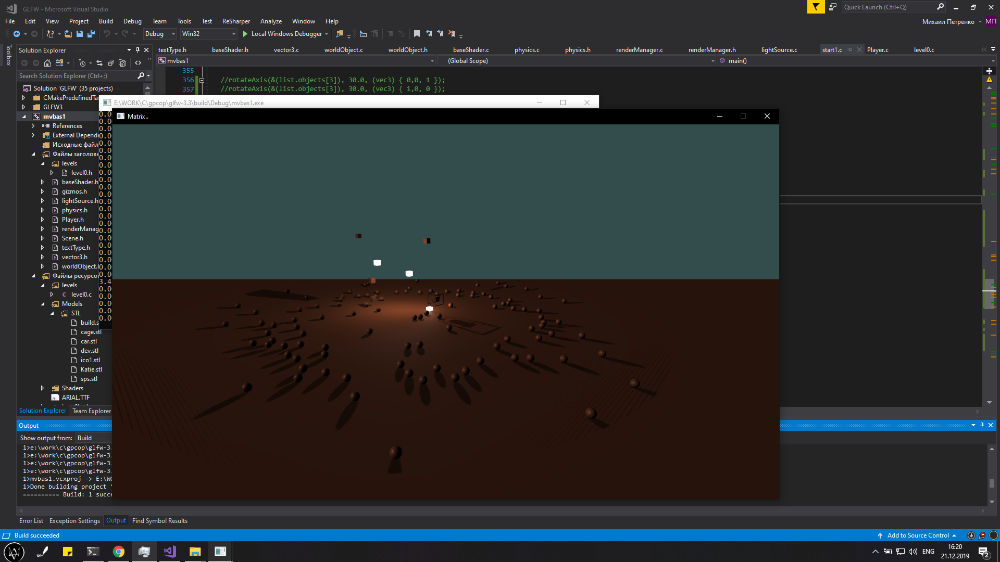

# Vortex
3D application written on pure C with openGl(+ GLFW)
Is done educational project

If you just want to copy/find some GLSL code you are welcome to fragmentSh.fs file, blinn-phong lighting model and cubemaps are used there.

-Render meshes 
-Phong lighting  
-Direct and Point light sources with shadows  
-(Process)Multiple light sources(done: multiple point lights)  
-(Process)R/B physics (done: cube and sphere phisics)

Also Very usefull resource is [Link](https://learnopengl.com/)

Screensots

It can hadle decent amount of spheres at the same time

Force field attracting objects around

Lighting

